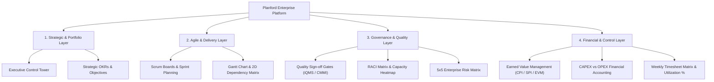

# Planford — Open-Source Enterprise Program & Delivery Management Platform

[](https://www.gnu.org/licenses/agpl-3.0)
[](https://www.php.net/)
[](https://www.mysql.com/)
[](#-active-development-notice)
[](https://github.com/LubhataSoftwareAndInnovations/Planford)

**Planford** is a modern, high-performance, open-source Enterprise Program & Delivery Management platform engineered by **Lubhata - Software & Innovations**. It provides multi-methodology execution (**Agile Scrum**, **Kanban**, **Waterfall / V-Model**, and **Hybrid Delivery**), quality governance gates, Earned Value Management (EVM) financial controls, RACI matrices, and 5x5 risk heatmaps.

---

> [!WARNING]
> ### 🚧 Active Development Notice
> **Planford is currently under active development.** Architectural components, APIs, and enterprise modules are evolving rapidly. Features marked with `[Active Construction]` are being actively enhanced. Community feedback and contributions are warmly welcome!

---

## 🌟 Why Planford? (Jira Align & SAP PPM Alternative)

Planford bridges the gap between lightweight issue trackers and bloated legacy enterprise PPM systems. It combines the agile flexibility of Jira with the rigorous financial and governance controls of SAP Portfolio and Project Management (PPM).



---

## ✨ Enterprise Features At A Glance

### 1. 🎯 Executive Control Tower & Portfolio Health
- Real-time **Portfolio RAG Status** (Red / Amber / Green) rollup based on delivery performance and budget metrics.
- High-level KPI dashboards tracking active programs, overdue tasks, velocity, and completion rates.

### 2. 🔄 Multi-Methodology Execution (Scrum, Kanban, Waterfall, Hybrid)
- **Interactive Sprint Board**: 5-column drag-and-drop board (*To Do*, *In Progress*, *Code Review*, *Done*, *Blocked*) with Story Points, Epics, Bugs, and Spikes.
- **Sprints & Backlog**: Iteration commitment, capacity planning, velocity charts, and backlog grooming tools.

### 3. 📊 Visual Gantt Chart & 2D Dependency Matrix
- **Gantt Schedule**: Interactive timeline rendering Program, Track, Phase, and Task progress.
- **Task Linkages**: Supports Finish-to-Start (**FS**), Start-to-Start (**SS**), Finish-to-Finish (**FF**), and Start-to-Finish (**SF**) linkages with critical path analysis.
- **2D Dependency Matrix**: Cross-team blocker matrix and commitment resolution map.

### 4. 🛡️ Quality Governance Gates & iQMS Compliance
- Mandatory phase sign-off checkpoints (*Architecture Freeze*, *Security Vulnerability Sign-off*, *UAT Acceptance*, *Go-Live Gate*).
- Complete immutable audit log capturing timestamp, PM reviewer, and audit notes.

### 5. 📈 Earned Value Management (EVM) Financial Control
- **Cost Performance Index ($CPI = EV / AC$)** & **Schedule Performance Index ($SPI = EV / PV$)**.
- Real-time calculation of **Planned Value (PV)**, **Earned Value (EV)**, **Actual Cost (AC)**, **Cost Variance (CV)**, and **Schedule Variance (SV)**.

### 6. 👥 RACI Matrix & Developer Capacity Heatmap
- **RACI Governance Grid**: Assign *Responsible*, *Accountable*, *Consulted*, and *Informed* roles across deliverables.
- **Resource Workload Heatmap**: Real-time developer allocation percentage bars across concurrent programs to prevent burnout.

### 7. 🎯 Strategic Portfolio OKRs (Objectives & Key Results)
- Align program deliverables to corporate strategic goals (*Strategic*, *Operational*, *Quality*, *Financial*).
- Track target vs. current key result metrics and completion percentages.

### 8. 🚨 5x5 Enterprise Risk Heatmap (ISO 31000 Standard)
- Visual 5x5 Likelihood (*Rare* to *Almost Certain*) vs. Impact (*Low* to *Critical*) matrix.
- Automatic Risk Exposure Score ($Exposure = Likelihood \times Impact$) with color-coded risk severity zones.

### 9. 💰 CAPEX vs. OPEX Financial Accounting
- Distinguish between **Capital Expenditure (CAPEX)** for software IP assets and **Operational Expense (OPEX)**.
- **Capitalization Ratio**: Automated calculation for tax compliance and audit reporting.

### 10. ⏱️ Weekly Timesheets & Utilization Tracking
- Daily worklog entries logged per developer, program, and task.
- Automated **Resource Utilization Ratio** (% Billable vs Non-Billable hours) and manager approval workflows.

### 11. ⚙️ Dynamic Custom Field & Automation Rule Engines
- **Custom Fields**: Register custom text, number, dropdown, or date fields dynamically.
- **Automation Rules**: Event-driven **WHEN (Trigger) ➔ THEN (Action)** rule builder (*e.g., When Task Blocked ➔ Auto-escalate to Critical Priority*).

---

## ⚡ Quickstart & Installation

### Prerequisites
- **Web Server**: Apache 2.4+ (with `mod_rewrite` enabled) or Nginx
- **PHP**: 8.2 or 8.3+ (with `mysqli`, `json`, `mbstring`, `openssl` extensions)
- **Database**: MySQL 8.0+ or MariaDB 10.5+

### Installation Steps

1. **Clone the Repository**:
   ```bash
   git clone https://github.com/Lubhata/Planford.git
   cd Planford
   ```

2. **Configure Apache / Virtual Host**:
   Ensure `AllowOverride All` is set in your Apache configuration to permit `.htaccess` URL rewriting.

3. **Import Database Schema**:
   * **Clean Database (No sample data)**:
     ```bash
     mysql -u root -p planford < install/schema.sql
     ```
   * **Full Sample Database (With pre-populated demo data)**:
     ```bash
     mysql -u root -p planford < install/schema_sample_data.sql
     ```

4. **Update Configuration**:
   Edit `config/config.php` to set your database credentials:
   ```php
   define('DB_HOST', 'localhost');
   define('DB_USER', 'root');
   define('DB_PASS', 'your_password');
   define('DB_NAME', 'planford');
   ```

5. **Access the App**:
   Open `http://localhost/planford/` in your browser.

---

## 🔑 Default Credentials (Demo Database)

If you imported `install/schema_sample_data.sql`, use any of the following demo accounts:

| Role | Email | Password |
| :--- | :--- | :--- |
| **Super Admin (VP)** | `admin@planford.io` | `Admin@123` |
| **Program Manager** | `pm@planford.io` | `Admin@123` |
| **Team Member (Architect)** | `member@planford.io` | `Admin@123` |
| **Client Stakeholder** | `stakeholder@planford.io` | `Admin@123` |

---

## 📄 License & Publisher Information

**Planford** is free software published under the **GNU Affero General Public License v3.0 (AGPL-3.0)**.

Published & Maintained by **Lubhata - Software & Innovations**  
Repository: [https://github.com/Lubhata/Planford](https://github.com/LubhataSoftwareAndInnovations/Planford)  
License: [GNU AGPL-3.0](LICENSE)
